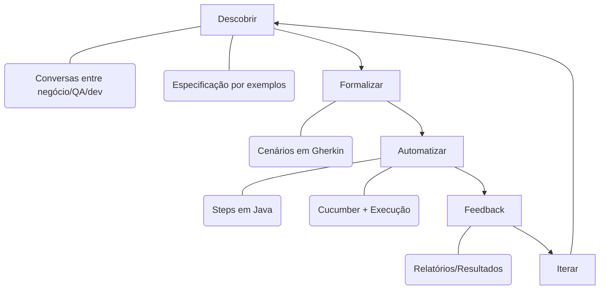

# Changelog

## Branch: 20251027-gerkhin

Data: 2025-10-27

### O que é Gherkin?

**Gherkin** é uma linguagem de especificação de comportamento legível por humanos, criada para facilitar a comunicação entre stakeholders técnicos e não-técnicos em projetos de software. Utiliza palavras-chave estruturadas em linguagem natural (como `Given`, `When`, `Then`) para descrever o comportamento esperado de um sistema.

#### Por que Gherkin é importante para BDD?

**Behavior-Driven Development (BDD)** é uma metodologia ágil que enfatiza a colaboração entre desenvolvedores, testadores e stakeholders de negócio. Gherkin é a linguagem padrão para BDD porque:

- **Comunicação Clara**: Permite que todos entendam os requisitos sem conhecimento técnico
- **Documentação Viva**: Os cenários Gherkin servem como documentação executável e sempre atualizada
- **Testes Automatizados**: Os cenários podem ser transformados em testes automatizados através de frameworks como Cucumber
- **Foco no Comportamento**: Descreve "o quê" o sistema deve fazer, não "como" ele faz
- **Colaboração**: Facilita discussões entre equipes multidisciplinares usando uma linguagem comum
- **Especificação por Exemplo**: Usa exemplos concretos para esclarecer requisitos ambíguos

#### Estrutura do Gherkin

```gherkin
Feature: Título da funcionalidade
  Como um [papel]
  Eu quero [funcionalidade]
  Para que [benefício]

  Scenario: Descrição do cenário
    Given [pré-condição]
    When [ação]
    Then [resultado esperado]
    And [resultado adicional]
```

##### Como criar a estrutura (passo a passo)

1. Crie um arquivo `.feature` em `src/test/resources/features/`.
   - Comece com `Feature:` e uma breve descrição (papel, objetivo, benefício).
   - Opcional: use `Background:` para passos comuns a todos os cenários.
2. Adicione cenários com `Scenario:` ou cenários parametrizados com `Scenario Outline:` + `Examples:`.
   - Palavras‑chave: `Given`/`When`/`Then`/`And`/`But` (ou em PT‑BR: `Dado`/`Quando`/`Então`/`E`/`Mas`).
   - Use tabelas (data tables) quando houver múltiplos campos de entrada.
   - Use tags como `@smoke`, `@regression` para agrupar/filtrar execuções.
3. Implemente os Steps em Java em `src/test/java/.../stepdefinitions/`.
   - Faça o binding com anotações do Cucumber (`@Given`, `@When`, `@Then`).
   - Compartilhe estado entre steps via campos da classe.
   - Integre com Spring Boot Test, Testcontainers e clientes HTTP para exercitar o sistema.
4. Crie um Runner JUnit em `src/test/java/.../cucumber/`.
   - Configure `@CucumberOptions(features=..., glue=..., plugin=...)`.
5. Garanta as dependências no `pom.xml` (`cucumber-java`, `cucumber-junit`, `cucumber-spring`) e o Surefire incluindo `*Runner.java`.
6. Execute: `mvn test -Dtest=StudentRegistrationTestRunner` ou a feature específica com `-Dcucumber.features=...`.

Exemplo mínimo de `.feature` com cenário parametrizado:

```gherkin
Feature: Registro de estudante

  Scenario Outline: Validar email institucional
    Given existe um estudante com email "<email>"
    When eu submeto o registro
    Then o resultado deve ser "<status>"

    Examples:
      | email              | status   |
      | ana@senac.br       | sucesso  |
      | ana@gmail.com      | falha    |
```

Exemplo mínimo de Step Definition (Java):

```java
@Given("existe um estudante com email {string}")
public void existeUmEstudanteComEmail(String email) {
    this.aluno = new Aluno("Ana", email, 20);
}

@When("eu submeto o registro")
public void euSubmetoORegistro() {
    response = restTemplate.postForEntity(baseUrl + "/alunos", aluno, String.class);
}

@Then("o resultado deve ser {string}")
public void oResultadoDeveSer(String status) {
    if (status.equals("sucesso")) assertTrue(response.getStatusCode().is2xxSuccessful());
    else assertEquals(HttpStatus.BAD_REQUEST, response.getStatusCode());
}
```

#### Behavior‑Driven Development (BDD) e Behavior‑Driven Testing (BDT)

- BDD: abordagem de desenvolvimento orientada a comportamento que promove colaboração entre negócio, QA e dev para descobrir, formalizar e automatizar requisitos usando uma linguagem onívoca (ex.: Gherkin).
  - Ciclo: Descobrir (conversas + exemplos) → Formalizar (cenários Gherkin) → Automatizar (Cucumber executando os cenários).
- BDT: prática de teste focada no comportamento especificado — é a automação/execução dos cenários definidos no BDD, garantindo que os critérios de aceitação sejam verificados continuamente.
- Diferença prática: BDD é o processo colaborativo de especificação; BDT é a verificação automatizada dessa especificação.

##### Diagrama do ciclo BDD (Mermaid)



#### Padrão AAA (Arrange-Act-Assert) em Testes

O **padrão AAA** é uma estrutura universalmente reconhecida para organizar testes unitários e de integração, tornando-os mais legíveis e mantendáveis. Gherkin naturalmente implementa este padrão:

##### **Arrange (Preparar)** - `Given`
- Configura o contexto inicial do teste
- Prepara dados, mocks, e estado do sistema
- Define pré-condições necessárias

```gherkin
Given I have a student with the following details:
  | name  | João Silva          |
  | email | joao.silva@senac.br |
  | age   | 20                  |
And the email contains the required "@senac" domain
```

##### **Act (Agir)** - `When`
- Executa a ação principal do teste
- Invoca o método/endpoint sob teste
- É onde o comportamento é exercitado

```gherkin
When I submit the student registration form to the API endpoint "/api/v1/alunos"
```

##### **Assert (Verificar)** - `Then` / `And`
- Verifica os resultados esperados
- Valida estado final, retornos e efeitos colaterais
- Confirma que o comportamento está correto

```gherkin
Then the registration should be successful with HTTP status code 201
And the system should return the registered student information
And the response should contain a generated student ID
And the response should include the student name "João Silva"
```

##### Mapeamento Gherkin ↔ AAA

| Gherkin | AAA | Propósito | Exemplo |
|---------|-----|----------|----------|
| `Given` | **Arrange** | Preparar contexto | Criar dados de teste |
| `And` (após Given) | **Arrange** | Condições adicionais | Configurar estado |
| `When` | **Act** | Executar ação | Chamar API/método |
| `Then` | **Assert** | Verificar resultado | Validar status 201 |
| `And` (após Then) | **Assert** | Verificações adicionais | Validar campos retornados |

##### Benefícios do Padrão AAA

1. **Legibilidade**: Estrutura clara e previsível
2. **Manutenção**: Fácil identificar o que cada parte faz
3. **Debug**: Problemas são rapidamente localizados
4. **Padronização**: Todos os testes seguem a mesma estrutura
5. **Documentação**: Testes servem como exemplos de uso

##### Exemplo Completo: AAA em Gherkin vs Java

**Gherkin (BDD)**:
```gherkin
# ARRANGE: Preparar dados do estudante
Given I have a student with email "joao@senac.br"
And the database is empty

# ACT: Executar registro
When I submit the student registration form

# ASSERT: Verificar resultado
Then the registration should be successful
And the student should exist in the database
```

**Java (TDD)**:
```java
@Test
void testStudentRegistration() {
    // ARRANGE: Preparar
    Aluno aluno = new Aluno("João", "joao@senac.br", 20);
    repository.deleteAll();
    
    // ACT: Agir
    ResponseEntity<Aluno> response = controller.createAluno(aluno);
    
    // ASSERT: Verificar
    assertEquals(HttpStatus.CREATED, response.getStatusCode());
    assertTrue(repository.existsByEmail("joao@senac.br"));
}
```

##### Antipadrões a Evitar

❌ **Múltiplos Acts**:
```gherkin
When I submit the registration form
And I submit another registration form  # Evite!
```
✅ **Solução**: Criar cenários separados para cada ação principal.

❌ **Assert no Arrange**:
```gherkin
Given the system has 5 students  # OK
And the student count should be 5  # Evite verificar aqui!
```
✅ **Solução**: Verificar apenas no `Then`.

❌ **Lógica no Assert**:
```gherkin
Then the registration should succeed or fail based on email  # Vago!
```
✅ **Solução**: Ser explícito sobre o resultado esperado.

### Mudanças Principais

#### 1. Implementação de Testes BDD com Cucumber + Gherkin

**Adicionado**: `src/test/resources/features/studentRegistration.feature`
- Feature de registro de estudantes escrita em Gherkin com padrão AAA
- **6 cenários de teste abrangentes**:
  - ✅ Registro bem-sucedido com email institucional válido
  - ❌ Rejeição quando email não contém domínio institucional
  - ❌ Rejeição quando campo email está vazio
  - ❌ Rejeição quando campo nome está vazio
  - ✅ Registro com idade mínima válida
  - ❌ Rejeição quando idade é negativa
- **Background** comum para todos os cenários
- **Data tables** para estruturar dados de entrada
- **Comentários AAA** explicando cada fase do teste
- **Asserções granulares** verificando cada aspecto da resposta
- **HTTP status codes explícitos** (201, 400)
- **Mensagens de erro específicas** para cada tipo de falha
- **Validação de estado** (verificação de persistência)
- Especificações legíveis por stakeholders não-técnicos
- Documentação executável do comportamento esperado

**Adicionado**: `src/test/java/com/example/studentregistration/stepdefinitions/StudentRegistrationStepDefinitions.java`
- Implementação dos steps do Gherkin em Java
- Binding entre cenários Gherkin e código de teste
- Integração com Spring Boot Test, Testcontainers (PostgreSQL) e TestRestTemplate
- Validações de resposta HTTP e mensagens de erro

**Adicionado**: `src/test/java/com/example/studentregistration/cucumber/StudentRegistrationTestRunner.java`
- Runner do Cucumber com JUnit
- Configuração de features e glue packages
- Geração de relatórios de teste

##### Exemplo real do projeto (trecho do .feature)

```gherkin
Scenario: Successfully register a new student with valid institutional email
  Given I have a student with the following details:
    | name  | João Silva           |
    | email | joao.silva@senac.br  |
    | age   | 20                   |
  And the email contains the required "@senac" domain
  When I submit the student registration form to the API endpoint "/api/v1/alunos"
  Then the registration should be successful with HTTP status code 201
  And the system should return the registered student information
```

#### 2. Dependências Cucumber (pom.xml)

```xml
<!-- Cucumber para BDD -->
<dependency>
    <groupId>io.cucumber</groupId>
    <artifactId>cucumber-java</artifactId>
    <version>7.14.0</version>
    <scope>test</scope>
</dependency>
<dependency>
    <groupId>io.cucumber</groupId>
    <artifactId>cucumber-junit</artifactId>
    <version>7.14.0</version>
    <scope>test</scope>
</dependency>
<dependency>
    <groupId>io.cucumber</groupId>
    <artifactId>cucumber-spring</artifactId>
    <version>7.14.0</version>
    <scope>test</scope>
</dependency>
```

#### 3. Funcionalidade VCR para Testes de API

**Objetivo Educacional**: Demonstrar como gravar e reproduzir requisições HTTP para testes determinísticos de APIs externas.

**Arquivos criados**:
- `src/main/java/com/example/studentregistration/vcr/*.java` - Classes VCR
- `src/test/java/com/example/studentregistration/vcr/VCRViaCEPServiceTest.java` - Testes usando VCR
- `src/test/resources/vcr_cassettes/viacep_test.json` - Cassette com interações gravadas
- `vcr_teaching_guide.md` - Guia educacional sobre VCR

**VCR (Video Cassette Recorder) Pattern**:
- Grava requisições HTTP reais em arquivos JSON ("cassettes")
- Reproduz as respostas gravadas em execuções futuras
- Elimina dependência de APIs externas durante testes
- Testes mais rápidos e determinísticos

#### 4. Melhorias em Testes Existentes

**Atualizado**: `src/test/java/com/example/studentregistration/service/AlunoServiceTest.java`
- Testes parametrizados aprimorados
- Cobertura de casos de equivalência

**Adicionado**: `src/test/java/com/example/studentregistration/controller/AlunoControllerTest.java`
- Testes unitários do controller com MockMvc
- Validação de endpoints REST

**Adicionado**: `src/test/java/com/example/studentregistration/service/ViaCEPServiceTest.java`
- Testes do serviço de integração com ViaCEP

#### 5. Nova Funcionalidade: Integração com ViaCEP

**Adicionado**: `src/main/java/com/example/studentregistration/service/ViaCEPService.java`
- Serviço para consultar CEP via API ViaCEP
- Exemplo de integração com API externa

**Adicionado**: `src/main/java/com/example/studentregistration/controller/CepController.java`
- Endpoint REST para consulta de CEP

**Adicionado**: `src/main/java/com/example/studentregistration/model/ViaCEPResponse.java`
- Modelo de resposta da API ViaCEP

### Vantagens da Abordagem BDD com Gherkin

#### 1. **Three Amigos Collaboration**
Gherkin facilita a colaboração entre:
- **Business**: Define requisitos em linguagem natural
- **Development**: Implementa funcionalidades baseadas em cenários claros
- **Testing**: Automatiza testes a partir das especificações

#### 2. **Living Documentation**
```gherkin
# Este cenário é executável E serve como documentação
Scenario: Successfully register a new student
  Given I have student details with valid information
  When I submit the student registration form
  Then the student should be successfully registered
```
- Documentação sempre sincronizada com o código
- Testes que documentam e documentação que testa

#### 3. **Descoberta de Requisitos**
Gherkin expõe ambiguidades:
```gherkin
# Pergunta: O que é um email válido?
Given I have student details with email not containing "@senac"
# Resposta clara: Email deve conter "@senac"
```

#### 4. **Regressão e Manutenção**
- Cenários Gherkin são mais estáveis que testes unitários
- Mudanças na implementação não quebram os cenários
- Foco no comportamento, não na implementação

### BDD vs TDD vs Traditional Testing

| Aspecto | Traditional | TDD | BDD |
|---------|------------|-----|-----|
| **Foco** | Validar código | Código limpo | Comportamento |
| **Linguagem** | Técnica | Técnica | Natural |
| **Colaboração** | Baixa | Média | Alta |
| **Documentação** | Separada | Código | Executável |
| **Exemplo** | Assert equals | Test first | Given/When/Then |

### Como Executar os Testes BDD

#### Executar todos os testes Cucumber:
```bash
mvn test -Dtest=StudentRegistrationTestRunner
```

#### Executar feature específica:
```bash
mvn test -Dcucumber.features=src/test/resources/features/studentRegistration.feature
```

#### Ver relatório Cucumber:
```bash
# Relatórios gerados em target/cucumber-reports/
open target/cucumber-reports/index.html
```

### Estrutura de Arquivos de Teste

```
src/test/
├── java/
│   └── com/example/studentregistration/
│       ├── cucumber/
│       │   └── StudentRegistrationTestRunner.java  # Runner JUnit + Cucumber
│       ├── stepdefinitions/
│       │   └── StudentRegistrationStepDefinitions.java  # Steps Gherkin → Java
│       ├── controller/
│       │   └── AlunoControllerTest.java  # Testes unitários REST
│       ├── service/
│       │   ├── AlunoServiceTest.java  # Testes parametrizados
│       │   └── ViaCEPServiceTest.java  # Testes de integração API
│       └── vcr/
│           └── VCRViaCEPServiceTest.java  # Testes com VCR
└── resources/
    ├── features/
    │   └── studentRegistration.feature  # Cenários Gherkin
    ├── vcr_cassettes/
    │   └── viacep_test.json  # Interações HTTP gravadas
    └── application-test.properties  # Configuração de teste
```

### Exemplo Prático: Do Requisito ao Teste

#### 1. Requisito de Negócio
> "Como administrador, quero validar que o email do estudante contenha '@senac' para garantir que apenas emails institucionais sejam aceitos."

#### 2. Cenário Gherkin
```gherkin
Scenario: Register a student with invalid email
  Given I have student details with email not containing "@senac"
  When I submit the student registration form
  Then the registration should fail
  And the system should return an error message "Email inválido. O email deve conter '@senac'."
```

#### 3. Step Definition (Java)
```java
@Given("I have student details with email not containing {string}")
public void iHaveStudentDetailsWithEmailNotContaining(String domain) {
    alunoRequest = new Aluno("João Silva", "joao@gmail.com", 20);
}
```

#### 4. Execução Automatizada
- Cucumber executa o cenário
- Steps são traduzidos em chamadas de API
- Validações verificam comportamento esperado
- Relatório mostra sucesso/falha em linguagem natural

### Benefícios Observados

- ✅ **Requisitos Claros**: Stakeholders entendem os cenários
- ✅ **Testes Reutilizáveis**: Steps podem ser combinados em novos cenários
- ✅ **Documentação Viva**: Features sempre atualizadas
- ✅ **Descoberta Precoce**: Ambiguidades identificadas antes do desenvolvimento
- ✅ **Manutenção Facilitada**: Mudanças na implementação não quebram cenários

### Recursos de Aprendizado

- **Cucumber Docs**: https://cucumber.io/docs/guides/
- **Gherkin Reference**: https://cucumber.io/docs/gherkin/reference/
- **BDD Fundamentals**: https://cucumber.io/docs/bdd/
- **VCR Teaching Guide**: `vcr_teaching_guide.md`

---

## Histórico Anterior

Data: 2025-10-13

## Resumo

- **Implementação completa de Testcontainers** para testes de integração com PostgreSQL real em containers Docker.
- **Substituição de H2 por PostgreSQL** nos testes, garantindo ambiente idêntico à produção.
- **Cobertura completa de testes CRUD** com 10 cenários ordenados cobrindo todos os endpoints da API.
- **Documentação técnica detalhada** sobre Testcontainers e suas vantagens.

## Mudanças

### Dependências (pom.xml)
- Adicionadas dependências do Testcontainers:
  - `org.testcontainers:junit-jupiter` (scope: test)
  - `org.testcontainers:postgresql` (scope: test) 
  - `org.springframework.boot:spring-boot-testcontainers` (scope: test)

### Testes de Integração
- **Criado**: `src/test/java/com/example/studentregistration/AlunoIntegrationTest.java`
  - Container PostgreSQL real (`postgres:15-alpine`)
  - 10 testes ordenados com `@TestMethodOrder(MethodOrderer.OrderAnnotation.class)`
  - Configuração dinâmica de propriedades com `@DynamicPropertySource`
  - Testes de CRUD completos:
    - `testCreateAluno()` - Criação com email válido
    - `testCreateAlunoWithInvalidEmail()` - Validação de email inválido
    - `testGetAllAlunos()` - Listagem de alunos
    - `testUpdateAluno()` - Atualização com dados válidos
    - `testUpdateAlunoWithInvalidEmail()` - Atualização com email inválido
    - `testUpdateNonExistentAluno()` - Atualização de aluno inexistente
    - `testDeleteAluno()` - Exclusão de aluno
    - `testDeleteNonExistentAluno()` - Exclusão de aluno inexistente
    - `testGetAllAlunosAfterDeletion()` - Verificação após exclusão
    - `testCreateMultipleAlunos()` - Criação de múltiplos alunos

### Configuração de Teste
- **Criado**: `src/test/resources/application-test.properties`
  - Configuração específica para Testcontainers
  - Logging detalhado para debugging
  - Hibernate DDL auto-create-drop

### Documentação
- **Criado**: `20251014.md` - Documentação completa sobre Testcontainers
  - Explicação dos benefícios (ambiente real, isolamento, reprodutibilidade)
  - Exemplos de código para todos os cenários
  - Instruções de execução e configuração
  - Referências técnicas

### Controller Aprimorado
- **Adicionados endpoints**:
  - `PUT /api/v1/alunos/{id}` - Atualização de aluno
  - `DELETE /api/v1/alunos/{id}` - Exclusão de aluno
- **Melhorada validação** com método `validateEmail()` centralizado
- **Tratamento de erros** aprimorado para todos os endpoints

### Documentação REST Atualizada
- **Atualizado**: `rest.md` com novos endpoints (PUT/DELETE)
- **Adicionados comandos PowerShell** para todos os endpoints
- **Exemplos de resposta** para sucesso e erro

### README Atualizado
- **Seção de testes** com instruções específicas para Testcontainers
- **Comandos PowerShell** para todos os endpoints
- **Instruções de execução** de testes

## Vantagens da Implementação

### Por que migrar do H2 para Testcontainers?

#### **Problemas do H2 em Testes de Integração**
- **Diferenças de Comportamento**: H2 é um banco em memória que pode ter comportamentos diferentes do PostgreSQL em produção
- **SQL Incompatível**: Algumas funcionalidades SQL específicas do PostgreSQL não funcionam no H2
- **Limitações de Recursos**: H2 não simula restrições de memória, conexões e performance de um banco real
- **Falsos Positivos**: Testes podem passar no H2 mas falhar em produção com PostgreSQL
- **Configurações Diferentes**: Hibernate pode se comportar diferente entre H2 e PostgreSQL

#### **Vantagens dos Testcontainers**
- **Ambiente Real**: PostgreSQL real vs H2 em memória
- **Isolamento**: Container isolado por execução
- **Reprodutibilidade**: Funciona em qualquer ambiente
- **Limpeza Automática**: Containers removidos automaticamente
- **Configuração Dinâmica**: URLs configuradas automaticamente
- **Compatibilidade Total**: Mesmo banco usado em produção
- **Testes Mais Confiáveis**: Reduz falsos positivos e negativos

### Por que não usar Mocks em Testes de Integração?

#### **Limitações dos Mocks**
- **Não Testam Integração Real**: Mocks simulam comportamento, não testam a integração real entre componentes
- **Manutenção Complexa**: Mocks precisam ser atualizados sempre que a API muda
- **Falsos Positivos**: Testes com mocks podem passar mesmo com bugs reais
- **Não Detectam Problemas de Performance**: Mocks não simulam latência, timeouts, ou problemas de conexão
- **Não Testam Transações**: Mocks não testam rollbacks, commits, ou isolamento de transações
- **Não Validam SQL**: Mocks não executam queries reais, não detectam problemas de SQL
- **Não Testam Constraints**: Mocks não validam foreign keys, unique constraints, ou triggers

#### **Vantagens dos Testcontainers sobre Mocks**
- **Testes Reais**: Executam operações reais no banco de dados
- **Detecção de Problemas**: Identificam problemas de SQL, performance e integração
- **Validação Completa**: Testam constraints, transações e relacionamentos
- **Menos Manutenção**: Não precisam ser atualizados quando a API muda
- **Confiança Maior**: Testes que passam com Testcontainers têm alta probabilidade de funcionar em produção

### Evolução das Práticas de Teste

#### **Era dos Mocks (2000-2015)**
- **Foco**: Testes unitários rápidos com mocks
- **Problema**: Falsos positivos, não testavam integração real
- **Resultado**: Bugs em produção mesmo com testes "passando"

#### **Era do H2 (2010-2020)**
- **Foco**: Testes de integração com banco em memória
- **Problema**: Diferenças de comportamento entre H2 e PostgreSQL
- **Resultado**: Incompatibilidades e bugs específicos de banco

#### **Era dos Testcontainers (2015-presente)**
- **Foco**: Testes de integração com ambiente real
- **Vantagem**: Mesmo ambiente de produção, containers isolados
- **Resultado**: Testes mais confiáveis, menos bugs em produção

### Por que Testcontainers é o Padrão Moderno?

#### **Tendências Atuais**
- **DevOps e CI/CD**: Containers são padrão em pipelines
- **Microserviços**: Cada serviço tem seu próprio banco
- **Cloud Native**: Aplicações rodam em containers
- **Infrastructure as Code**: Infraestrutura versionada e reproduzível

#### **Benefícios para Equipes**
- **Desenvolvedores**: Testes funcionam em qualquer máquina
- **DevOps**: Mesma infraestrutura em dev, test e prod
- **QA**: Testes mais realistas e confiáveis
- **Produto**: Menos bugs em produção, maior qualidade

### Cobertura de Testes
- **10 cenários de teste** cobrindo todos os endpoints
- **Validação de email** com casos válidos e inválidos
- **Tratamento de erros** para casos não encontrados
- **Testes ordenados** garantindo sequência lógica
- **Assertions robustas** com verificações detalhadas

### Exemplos Práticos de Problemas Resolvidos

#### **Problema 1: SQL Específico do PostgreSQL**
```sql
-- Funciona no PostgreSQL, falha no H2
SELECT * FROM aluno WHERE email ILIKE '%senac%';
```
- **H2**: Não suporta `ILIKE`
- **Testcontainers**: Testa com PostgreSQL real

#### **Problema 2: Transações e Constraints**
```java
// Teste que falha com mocks, funciona com Testcontainers
@Test
void testConstraintViolation() {
    // Tenta inserir email duplicado
    // Mock: Sempre passa
    // Testcontainers: Falha corretamente com constraint violation
}
```

#### **Problema 3: Performance e Timeouts**
```java
// Teste de timeout que só funciona com banco real
@Test
void testSlowQuery() {
    // Mock: Retorna instantaneamente
    // Testcontainers: Simula latência real
}
```

#### **Problema 4: Configurações de Hibernate**
```properties
# Configurações que se comportam diferente entre H2 e PostgreSQL
spring.jpa.hibernate.ddl-auto=update
spring.jpa.properties.hibernate.dialect=org.hibernate.dialect.PostgreSQLDialect
```

## Como validar

### Executar testes com Testcontainers:
```bash
# Todos os testes
mvn test

# Apenas testes de integração
mvn test -Dtest=AlunoIntegrationTest

# Com output detalhado
mvn test -Dtest=AlunoIntegrationTest -X
```

### Verificar containers:
```bash
# Listar containers em execução
docker ps

# Ver logs do container de teste
docker logs <container_id>
```

### Relatórios:
- **Surefire**: `target/surefire-reports/`
- **Logs**: Console output com detalhes do Testcontainers
- **Container logs**: Logs do PostgreSQL em tempo real

## Requisitos Técnicos

- **Docker** instalado e rodando
- **Java 17+** (compatível com Testcontainers)
- **Maven 3.6+** para execução dos testes
- **PostgreSQL 15** (baixado automaticamente via Docker)
